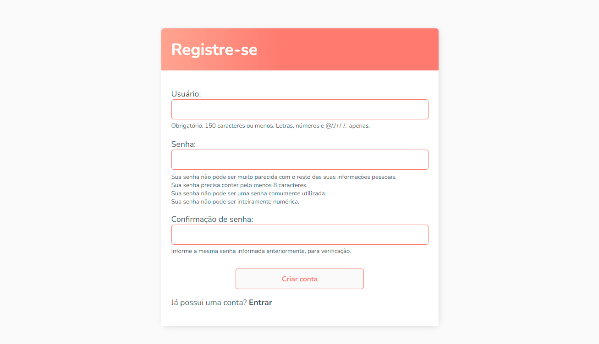

<h1 align="center">To Do List Project</h1>

  
  
  
  

  <a href="#-tecnologias">Tecnologias</a>&nbsp;&nbsp;&nbsp;|&nbsp;&nbsp;&nbsp;
  <a href="#-projeto">Projeto</a>&nbsp;&nbsp;&nbsp;

  

## 🚀 Tecnologias

Esse projeto foi desenvolvido com as seguintes tecnologias:

- Python
- Framework Django
- HTML
- CSS

## 💻 Projeto

Um projeto de uma To Do List com sistema de registro e login de usuário feita em Python com o framework Django a partir do vídeo: https://youtu.be/llbtoQTt4qw
